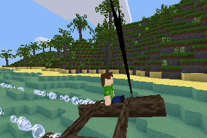

# Sailory

A makeover of the sailboat from the sailing mod. This version is more
modular and does not have hard dependencies that are not included in the modpack.

## Authors:
Originally: cakenggt
Makeover by: NetherEran

### How to use
* Jump: Put up or take down the sails
* Left, right: turn the boat
* Sneak + left or right: turn the sail

The flag above the sail shows the direction of the wind.
Right click the boat with dye to dye the flag or the sail:
If the sail is up, the sail is dyed, otherwise the flag.

### Crafting
Only enabled if 'default' is installed.

*Sail:*

|       | paper | stick |
| ----- | ----- | ----- |
| paper | paper | stick |
|       |       | stick |

*Canoe:*

| log | stick | log |
| ----- | ----- | ----- |
| log | sail | log |
| log | stick | log |

### Dependencies
Optional: default, dye

### License
Code: MIT
Media: CC BY-SA 3.0
